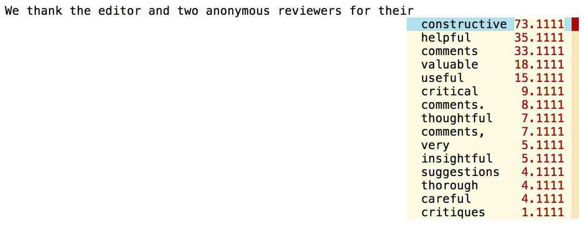

# company-ngram

A company backend for N-gram based completion.



This backend produces completion candidates that are fuzzily matching N-gram data.
The N-gram data is automatically constructed from `*.txt` files placed directly under `company-ngram-data-dir` directory.
If you set `company-ngram-n` to `4`, three words before the cursor are used to produce completion candidates.

To mitigate the data sparsity problem, this backend uses a fuzzy-matching strategy.
Given the following sentence, `Dear Dr. Aki, ▍`, this backend produces completion candidates that match at least one of following prefixes,

```
Dear Dr. Aki,
*    Dr. Aki,
Dear *   Aki,
*    *   Aki,
Dear Dr. *
*    Dr. *
Dear *   *
```

where `*` matches an arbitrary word.
Hence, even if your `*.txt` does not contain the word `Aki`, you still have chance to get completion candidates.

## Configurations

```elisp
; ~/.emacs.d/init.el

(with-eval-after-load 'company-ngram
  ; ~/data/ngram/*.txt are used as data
  (setq company-ngram-data-dir "~/data/ngram")
  ; company-ngram supports python 3 or newer
  (setq company-ngram-python "/path/to/python3")
  (company-ngram-init)
  (add-to-list 'company-backends 'company-ngram-backend)
  ; or use `M-x turn-on-company-ngram' and
  ; `M-x turn-off-company-ngram' on individual buffers
  ;
  ; save the cache of candidates
  (run-with-idle-timer 3600 t
                       (lambda ()
                         (company-ngram-command "save_cache")
                         ))
  )

(require 'company-ngram nil t)
```

[RFC](http://www.rfc-editor.org/rfc-index.html) provides handy text files for a quick trial.

```bash
wget --directory-prefix ~/data/ngram    https://www.rfc-editor.org/rfc/rfc{5661,6716,4949}.txt
```

## Tips

This backend may not work nicely if `company-idle-delay` is too small.
I am setting `company-idle-delay` as 0.2 s.

## License

[The GNU General Public License version 3](http://www.gnu.org/licenses/).
